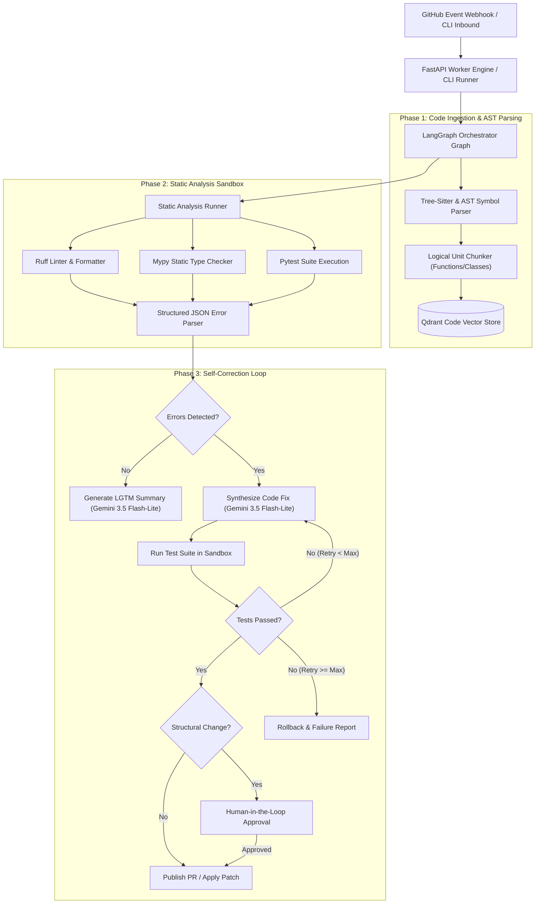
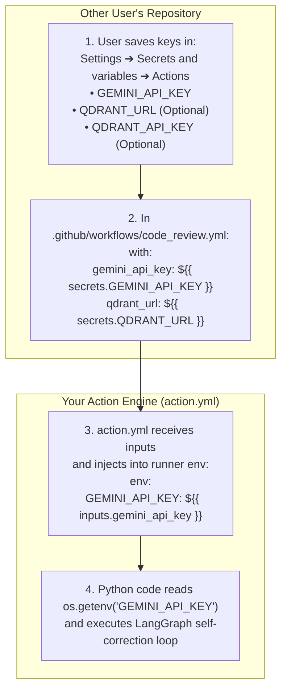

# Self-Correcting Code Review & Architectural Audit Agent

[](https://www.python.org/downloads/)
[](https://github.com/langchain-ai/langgraph)
[-blueviolet.svg)](https://ai.google.dev/)
[](https://qdrant.tech/)
[](https://tree-sitter.github.io/)

An autonomous developer tool and architectural auditor that integrates with GitHub pull requests and local code repositories. It performs automated codebase indexing, static analysis tool execution (`Ruff`, `Mypy`, `Pytest`), architectural health evaluation, and self-correcting code patch synthesis using Google Gemini Free Tier (`gemini-3.5-flash-lite`).

---

## 🌟 Key Features

- **Autonomous Self-Correction Loop**: Automated code repair -> sandbox testing -> error analysis -> retry graph loop (up to configurable max retries).
- **Free-Tier LLM First**: Powered by Google's fastest, budget-friendly model: `gemini-3.5-flash-lite` with exponential backoff and rate-limit tolerance.
- **Tree-Sitter & Code RAG**: Structural code parsing into logical functions/classes, call graph generation, and semantic vector indexing with **Qdrant**.
- **Human-in-the-Loop Safeguards**: Detects critical structural refactorings and breaking changes, intercepting them for manual approval before applying or posting PRs.
- **Isolated Sandbox Execution**: Test suite and static analysis execution with timeouts, process isolation, snapshotting, and automatic rollback if fixes fail.
- **FastAPI Webhook & CLI**: Full GitHub event listener (`pull_request.opened`, `push`) alongside an interactive CLI for local workspace audits.

---

## 🏗️ Architecture & Component Design



---

## 📊 State Schema (`AuditState`)

The orchestrator operates on a strongly typed LangGraph state dictionary:

```python
from typing import TypedDict, List, Dict, Any, Optional

class AuditState(TypedDict):
    repo_url: str
    commit_sha: str
    workspace_path: str
    pr_number: Optional[int]
    changed_files: List[str]
    ast_summary: Dict[str, Any]
    static_errors: List[Dict[str, Any]]
    suggested_patches: List[Dict[str, str]]
    test_results: Dict[str, Any]
    retry_count: int
    is_structural_change: bool
    is_approved_by_human: bool
    lgtm_summary: Optional[str]
    status: str
```

---

## 🚀 Quick Start

### 1. Installation

Clone the repository and initialize the virtual environment:

```bash
git clone https://github.com/your-username/CodeReviewArchitecturalAgent.git
cd CodeReviewArchitecturalAgent

python3 -m venv .venv
source .venv/bin/activate
pip install -r requirements.txt
```

### 2. Configure Environment

Copy `.env.example` to `.env` and set your Google AI Studio API key (free tier):

```bash
cp .env.example .env
```

Edit `.env`:
```ini
GEMINI_API_KEY=your_gemini_api_key_here
GEMINI_MODEL=gemini-3.5-flash-lite
```

*(Note: The agent includes deterministic heuristic fallback repair engines, so unit tests and offline audits can run even without an active API key).*

---

## 💻 Usage

### Local Repository Audit

Run an architectural and code review audit on any local codebase:

```bash
# Audit entire directory
python -m code_review_agent.cli audit --path ./my_project

# Audit specific changed files with auto-approval
python -m code_review_agent.cli audit --path . --files buggy_code.py --auto-approve
```

### Inspect AST Symbols & Code Chunks

Examine the Tree-Sitter extracted symbols and logical chunk boundaries:

```bash
python -m code_review_agent.cli index --path benchmark_sample
```

### Start GitHub Webhook Server

Launch the FastAPI listener for GitHub Pull Request events:

```bash
python -m code_review_agent.cli serve --host 0.0.0.0 --port 8000
```

---

## ⚡ Use as a GitHub Action in Any Repository

You can add this Self-Correcting Code Review Agent to **any GitHub repository** in seconds. No servers or hosting required!

Create `.github/workflows/code_review.yml` in the target repository:

```yaml
name: "Architectural Code Review"

on:
  pull_request:
    types: [opened, synchronize, reopened]

permissions:
  contents: write
  pull-requests: write
  issues: write

jobs:
  audit:
    runs-on: ubuntu-latest
    steps:
      - name: Checkout Code
        uses: actions/checkout@v4
        with:
          fetch-depth: 0

      - name: Run Self-Correcting Code Review Agent
        uses: your-username/CodeReviewArchitecturalAgent@v1
        with:
          gemini_api_key: ${{ secrets.GEMINI_API_KEY }}
          qdrant_url: ${{ secrets.QDRANT_URL }}
          qdrant_api_key: ${{ secrets.QDRANT_API_KEY }}
```

### 🔐 How Secrets & API Keys Work for Users of This Action

When other developers use your Action, **they never touch your `.env` file** (which remains strictly private and ignored by `.gitignore`). Instead, they securely inject their own keys via **GitHub Secrets**:



#### What If the User Doesn't Have a Qdrant Account?
- **Zero Configuration Required**: If `qdrant_url` or `qdrant_api_key` are omitted, the agent automatically initializes an in-memory Qdrant database (`:memory:`) inside the GitHub Action runner.
- They get full AST indexing and semantic vector search without needing any Qdrant Cloud account!

---

## 🚀 How to Publish to GitHub Marketplace

Publishing this repository as an official GitHub Marketplace Action takes just 3 steps:

1. **Push this repository to GitHub**:
   ```bash
   git remote add origin https://github.com/your-username/CodeReviewArchitecturalAgent.git
   git branch -M main
   git push -u origin main
   ```
2. **Draft a Release on GitHub**:
   - Go to your repository on GitHub.
   - On the right sidebar, click **Releases** -> **Draft a new release**.
   - Set tag: `v1.0.0`.
   - Title: `v1.0.0: Initial Release`.
3. **Publish to Marketplace**:
   - Check the banner box: **"Publish this Action to the GitHub Marketplace"**.
   - Choose primary category: **Code quality** or **Continuous integration**.
   - Click **Publish release**.

Your action will immediately appear on the **GitHub Marketplace** and can be used across any public or private repository!

## 🧪 Benchmark Suite & Verification

The repository includes a benchmark suite featuring intentional syntax errors, type incompatibilities, and logic bugs to measure the self-correction success rate:

```bash
# Run complete test suite (AST parser, error parser, sandbox rollback, LangGraph loop)
pytest tests/ -v
```

All 8 automated tests verify:
1. `test_ast_parsing_symbols`: Tree-Sitter symbol extraction and call graphs.
2. `test_code_chunker_logical_units`: Logical function/class chunk segmentation.
3. `test_parse_ruff_output`: JSON and text Ruff error parsing.
4. `test_parse_mypy_output`: Mypy type-check error structuring.
5. `test_parse_pytest_output`: Pytest failure stack trace parsing.
6. `test_sandbox_run_command`: Subprocess sandbox isolation and timeouts.
7. `test_sandbox_snapshot_and_rollback`: Pre-patch snapshotting and safe rollback.
8. `test_self_correcting_audit_workflow`: End-to-end self-correction LangGraph cycle on the benchmark sample.

---

## 📁 Repository Structure

```
CodeReviewArchitecturalAgent/
├── code_review_agent/
│   ├── __init__.py
│   ├── config.py                 # Configuration & Gemini 3.5 Flash-Lite settings
│   ├── state.py                  # AuditState TypedDict schema
│   ├── cli.py                    # Multi-command CLI (audit, index, serve)
│   ├── ingestion/
│   │   ├── ast_parser.py         # Tree-Sitter & AST symbol & call-graph extractor
│   │   ├── chunker.py            # Logical code chunker (functions/classes)
│   │   └── vector_store.py       # Qdrant vector store with Gemini embeddings
│   ├── analyzer/
│   │   ├── runner.py             # Ruff, Mypy, and Pytest runner
│   │   └── error_parser.py       # Structured diagnostic JSON parser
│   ├── sandbox/
│   │   └── executor.py           # Process sandbox, timeouts, snapshot & rollback
│   ├── llm/
│   │   └── gemini_client.py      # Google GenAI SDK client for gemini-3.5-flash-lite
│   ├── graph/
│   │   ├── nodes.py              # LangGraph individual execution nodes
│   │   └── workflow.py           # LangGraph StateGraph orchestration & routing
│   └── github/
│       ├── pr_manager.py         # PyGithub PR comments & patch commits
│       └── webhook.py            # FastAPI GitHub webhook listener
├── benchmark_sample/             # Intentionally buggy benchmarks for testing
│   ├── buggy_math.py
│   └── test_buggy_math.py
├── tests/                        # Automated unit and integration test suite
├── .env.example                  # Sample environment configuration
├── pyproject.toml                # Project packaging configuration
└── requirements.txt              # Frozen dependencies
```

---

## 📄 License

Apache License 2.0.
