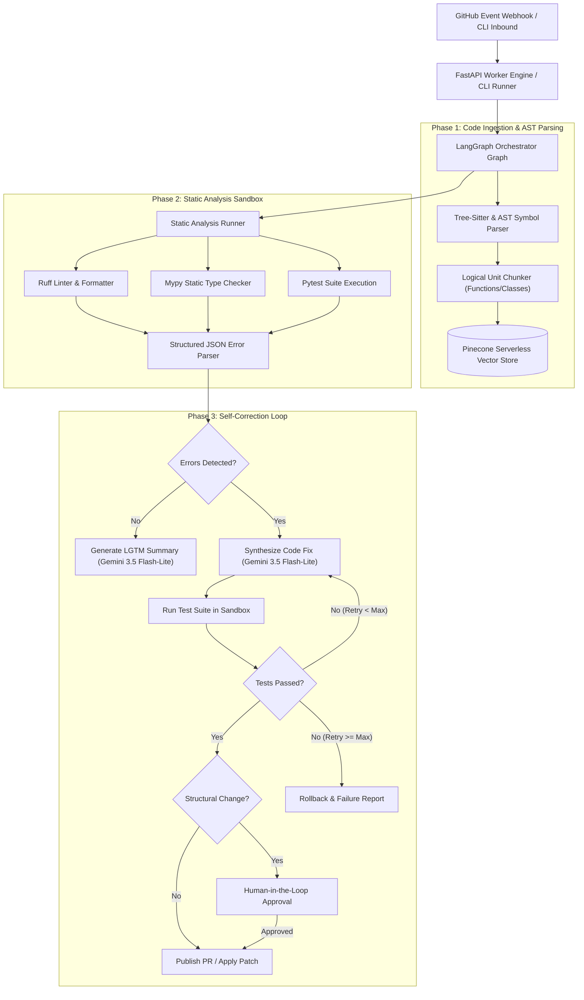
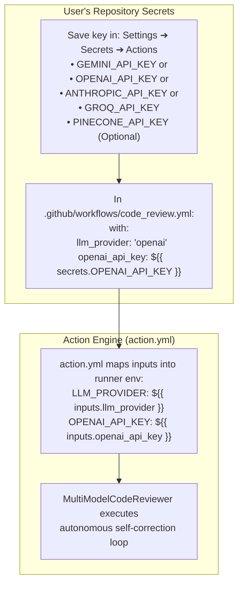

# Self-Correcting Code Review & Architectural Audit Agent

[](https://www.python.org/downloads/)
[](https://github.com/langchain-ai/langgraph)
[](https://ai.google.dev/)
[](https://www.pinecone.io/)
[](https://tree-sitter.github.io/)

An autonomous developer tool and architectural auditor that integrates with GitHub pull requests and local code repositories. It performs automated codebase indexing, static analysis tool execution (`Ruff`, `Mypy`, `Pytest`), architectural health evaluation, and self-correcting code patch synthesis using **any AI model of your choice** (Google Gemini, OpenAI GPT-4o, Anthropic Claude, Groq, or local Ollama).

---

## 🌟 Key Features

- **Multi-Model BYOK (Bring Your Own Key)**: Choose your preferred AI provider (`gemini`, `openai`, `anthropic`, `groq`, `ollama`, or `custom`) and pass your own API key with zero lock-in.
- **Autonomous Self-Correction Loop**: Automated code repair -> sandbox testing -> error analysis -> retry graph loop (up to configurable max retries).
- **Free-Tier & Local First**: Out-of-the-box support for Google Gemini Free Tier (`gemini-3.5-flash-lite`) and local offline models via Ollama (`qwen2.5-coder`, `deepseek-coder`).
- **Tree-Sitter & Code RAG**: Structural code parsing into logical functions/classes, call graph generation, and semantic vector indexing with **Pinecone** (Serverless, no 1-week pause timeouts).
- **Human-in-the-Loop Safeguards**: Detects critical structural refactorings and breaking changes, intercepting them for manual approval before applying or posting PRs.
- **Isolated Sandbox Execution**: Test suite and static analysis execution with timeouts, process isolation, snapshotting, and automatic rollback if fixes fail.
- **FastAPI Webhook & CLI**: Full GitHub event listener (`pull_request.opened`, `push`) alongside an interactive CLI for local workspace audits.

---

## 🤖 Supported Models & Providers (Bring Your Own Key)

The agent is model-agnostic. You can bring your own API key for any major provider, or run 100% locally and privately without API keys using Ollama:

| Provider | Supported Models (Examples) | Environment Variable | CLI Flag | Default Model |
| :--- | :--- | :--- | :--- | :--- |
| **Google Gemini** | `gemini-3.5-flash-lite`, `gemini-2.5-flash`, `gemini-1.5-pro` | `GEMINI_API_KEY` | `--provider gemini` | `gemini-3.5-flash-lite` |
| **OpenAI** | `gpt-4o-mini`, `gpt-4o`, `o1`, `o3-mini` | `OPENAI_API_KEY` | `--provider openai` | `gpt-4o-mini` |
| **Anthropic Claude** | `claude-3-5-haiku-20241022`, `claude-3-5-sonnet-latest` | `ANTHROPIC_API_KEY` | `--provider anthropic` | `claude-3-5-haiku-20241022` |
| **Groq** | `llama-3.3-70b-versatile`, `mixtral-8x7b-32768` | `GROQ_API_KEY` | `--provider groq` | `llama-3.3-70b-versatile` |
| **Local Ollama** | `qwen2.5-coder:7b`, `deepseek-coder:6.7b` *(100% Free & Offline)* | *None (Local)* | `--provider ollama` | `qwen2.5-coder` |
| **Custom / vLLM** | Any OpenAI-compatible endpoint | `LLM_BASE_URL` | `--provider custom` | `default` |

> [!TIP]
> **Smart Auto-Detection**: If you only provide `OPENAI_API_KEY`, `ANTHROPIC_API_KEY`, or `GROQ_API_KEY` in your environment, the agent automatically switches to that provider without needing extra configuration.

---

## 🏗️ Architecture & Component Design



---

## 📊 State Schema (`AuditState`)

The orchestrator operates on a strongly typed LangGraph state dictionary:

```python
from typing import TypedDict, List, Dict, Any, Optional

class AuditState(TypedDict):
    repo_url: str
    commit_sha: str
    workspace_path: str
    pr_number: Optional[int]
    changed_files: List[str]
    ast_summary: Dict[str, Any]
    static_errors: List[Dict[str, Any]]
    suggested_patches: List[Dict[str, str]]
    test_results: Dict[str, Any]
    retry_count: int
    is_structural_change: bool
    is_approved_by_human: bool
    lgtm_summary: Optional[str]
    status: str
```

---

## 🚀 Quick Start

### 1. Installation

Clone the repository and initialize the virtual environment:

```bash
git clone https://github.com/your-username/CodeReviewArchitecturalAgent.git
cd CodeReviewArchitecturalAgent

python3 -m venv .venv
source .venv/bin/activate
pip install -r requirements.txt
```

### 2. Configure Environment

Copy `.env.example` to `.env` and set your Google AI Studio API key (free tier):

```bash
cp .env.example .env
```

Edit `.env`:
```ini
# ==========================================
# 🤖 Multi-Model LLM Configuration (Bring Your Own Key)
# ==========================================
# Select provider: 'gemini' (default), 'openai', 'anthropic', 'groq', 'custom', 'ollama'
LLM_PROVIDER=gemini

# Specific model name (Optional - defaults to provider's best budget model):
#   - Gemini: gemini-3.5-flash-lite, gemini-2.5-flash, gemini-1.5-pro
#   - OpenAI: gpt-4o-mini, gpt-4o, o3-mini
#   - Anthropic: claude-3-5-haiku-20241022, claude-3-5-sonnet-latest
#   - Groq: llama-3.3-70b-versatile, mixtral-8x7b-32768
#   - Ollama / Custom: qwen2.5-coder:7b, deepseek-coder:6.7b
LLM_MODEL=

# --- Provider API Keys (Set the one matching LLM_PROVIDER) ---
GEMINI_API_KEY=your_gemini_api_key_here
OPENAI_API_KEY=
ANTHROPIC_API_KEY=
GROQ_API_KEY=

# Custom endpoint / Local Ollama URL (e.g. http://localhost:11434/v1 for 100% free local models)
LLM_BASE_URL=
```

*(Note: The agent includes deterministic heuristic fallback repair engines, so unit tests and offline audits can run even without an active API key).*

---

## 💻 Usage

### Local Repository Audit

Run an architectural and code review audit on any local codebase:

```bash
# Audit entire directory
python -m code_review_agent.cli audit --path ./my_project

# Audit specific changed files with auto-approval
python -m code_review_agent.cli audit --path . --files buggy_code.py --auto-approve

# 🤖 Run with your preferred AI model & API Key:
# Google Gemini (Free Tier / Paid):
python -m code_review_agent.cli audit --provider gemini --model gemini-2.5-flash --api-key AIzaSy...

# OpenAI GPT-4o / GPT-4o-mini:
python -m code_review_agent.cli audit --provider openai --model gpt-4o-mini --api-key sk-...

# Anthropic Claude 3.5 Sonnet / Haiku:
python -m code_review_agent.cli audit --provider anthropic --model claude-3-5-sonnet-latest --api-key sk-ant-...

# Groq (Ultra-fast inference):
python -m code_review_agent.cli audit --provider groq --model llama-3.3-70b-versatile --api-key gsk_...

# Local Ollama (100% Free, Private, and Offline):
python -m code_review_agent.cli audit --provider ollama --model qwen2.5-coder:7b
```

### Inspect AST Symbols & Code Chunks

Examine the Tree-Sitter extracted symbols and logical chunk boundaries:

```bash
python -m code_review_agent.cli index --path benchmark_sample
```

### Start GitHub Webhook Server

Launch the FastAPI listener for GitHub Pull Request events:

```bash
python -m code_review_agent.cli serve --host 0.0.0.0 --port 8000
```

---

## ⚡ Use as a GitHub Action (On-Demand & Quota-Friendly)

You can run this Self-Correcting Code Review Agent inside GitHub Actions. To **prevent burning through your free-tier AI quota on every commit**, the workflow is configured to run **on-demand (manually)** or only on relevant Pull Requests (ignoring docs and draft PRs).

### Workflow Configuration (`.github/workflows/code_review.yml`)

```yaml
name: "Self-Correcting Architectural Code Review"

on:
  # Manual on-demand execution from GitHub Actions UI (Saves AI Free Tier Quota)
  workflow_dispatch:
    inputs:
      auto_approve:
        description: "Automatically approve and commit verified patches"
        required: false
        default: "false"
        type: boolean

  # Only trigger on PRs for code changes (skips draft PRs and docs)
  pull_request:
    types: [opened, reopened]
    paths-ignore:
      - "**.md"
      - "docs/**"
      - ".gitignore"
      - "LICENSE"

permissions:
  contents: write
  pull-requests: write
  issues: write

jobs:
  review:
    # Skip draft PRs to protect AI quota on work-in-progress code
    if: github.event_name == 'workflow_dispatch' || (github.event_name == 'pull_request' && github.event.pull_request.draft == false)
    runs-on: ubuntu-latest
    steps:
      - name: Checkout Code
        uses: actions/checkout@v4
        with:
          fetch-depth: 0

      - name: Run Self-Correcting Code Review Agent
        uses: ./
        with:
          # Choose your provider: 'gemini' (default), 'openai', 'anthropic', 'groq'
          llm_provider: "gemini"
          gemini_api_key: ${{ secrets.GEMINI_API_KEY }}

          # Or to use OpenAI:
          # llm_provider: "openai"
          # llm_model: "gpt-4o-mini"
          # openai_api_key: ${{ secrets.OPENAI_API_KEY }}

          # Or to use Anthropic Claude:
          # llm_provider: "anthropic"
          # llm_model: "claude-3-5-sonnet-latest"
          # anthropic_api_key: ${{ secrets.ANTHROPIC_API_KEY }}

          pinecone_api_key: ${{ secrets.PINECONE_API_KEY }}
          github_token: ${{ secrets.GITHUB_TOKEN }}
          auto_approve: ${{ inputs.auto_approve || 'false' }}
```

### 🔐 How Secrets & Bring-Your-Own-Key Work for Users



#### What If you don't Have a Pinecone Account?
- **Zero Configuration Required**: If `pinecone_api_key` is omitted, the agent automatically initializes an in-memory vector database inside the runner.
- You get full AST indexing and semantic vector search without needing any Pinecone account or worrying about cluster timeouts!

## 🧪 Benchmark Suite & Verification

The repository includes a benchmark suite featuring intentional syntax errors, type incompatibilities, and logic bugs to measure the self-correction success rate:

```bash
# Run complete test suite (AST parser, error parser, sandbox rollback, LangGraph loop)
pytest tests/ -v
```

All 8 automated tests verify:
1. `test_ast_parsing_symbols`: Tree-Sitter symbol extraction and call graphs.
2. `test_code_chunker_logical_units`: Logical function/class chunk segmentation.
3. `test_parse_ruff_output`: JSON and text Ruff error parsing.
4. `test_parse_mypy_output`: Mypy type-check error structuring.
5. `test_parse_pytest_output`: Pytest failure stack trace parsing.
6. `test_sandbox_run_command`: Subprocess sandbox isolation and timeouts.
7. `test_sandbox_snapshot_and_rollback`: Pre-patch snapshotting and safe rollback.
8. `test_self_correcting_audit_workflow`: End-to-end self-correction LangGraph cycle on the benchmark sample.

---

## 📁 Repository Structure

```
CodeReviewArchitecturalAgent/
├── code_review_agent/
│   ├── __init__.py
│   ├── config.py                 # Configuration & Gemini 3.5 Flash-Lite settings
│   ├── state.py                  # AuditState TypedDict schema
│   ├── cli.py                    # Multi-command CLI (audit, index, serve)
│   ├── ingestion/
│   │   ├── ast_parser.py         # Tree-Sitter & AST symbol & call-graph extractor
│   │   ├── chunker.py            # Logical code chunker (functions/classes)
│   │   └── vector_store.py       # Pinecone vector store with Gemini embeddings
│   ├── analyzer/
│   │   ├── runner.py             # Ruff, Mypy, and Pytest runner
│   │   └── error_parser.py       # Structured diagnostic JSON parser
│   ├── sandbox/
│   │   └── executor.py           # Process sandbox, timeouts, snapshot & rollback
│   ├── llm/
│   │   └── gemini_client.py      # Google GenAI SDK client for gemini-3.5-flash-lite
│   ├── graph/
│   │   ├── nodes.py              # LangGraph individual execution nodes
│   │   └── workflow.py           # LangGraph StateGraph orchestration & routing
│   └── github/
│       ├── pr_manager.py         # PyGithub PR comments & patch commits
│       └── webhook.py            # FastAPI GitHub webhook listener
├── benchmark_sample/             # Intentionally buggy benchmarks for testing
│   ├── buggy_math.py
│   └── test_buggy_math.py
├── tests/                        # Automated unit and integration test suite
├── .env.example                  # Sample environment configuration
├── pyproject.toml                # Project packaging configuration
└── requirements.txt              # Frozen dependencies
```

---

## 📄 License

Apache License 2.0.
